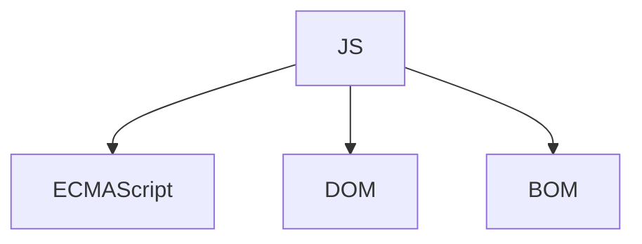

# 诞生

- JS 成为浏览器标配
- 网景公司 + SUN 公司
- 网景公司的 BE
- Mocha->LiveScript->JavaScript
- 微软的 IE3：JScript
- Ecma
- 网景公司+Sun+微软--》ECMA-262
- 各大浏览器实现

---

# 实现

ECMA-262 定义的是 ECMAScript

---

# ESMA

语法、类型、语句、关键字、保留字、操作符、全局对象

| 版本         |                                   |     |
| ------------ | --------------------------------- | --- |
| 262 的第一版 | 网景 JS1.1 相似 支持 Unicode 标准 |     |
| 262 的第二版 | 编校工作                          |     |
| 262 的第三版 | 字符串处理、错误、trycatch        |     |
| 262 的第四版 | 彻底修订 继承                     |     |
| 262 的第五版 | 原生的解析、序列化 JSON 数据      |     |

---

# 版本

| 版本              |               |                  |                                                                                                                             |
| ----------------- | ------------- | ---------------- | --------------------------------------------------------------------------------------------------------------------------- |
| ECMA-262 第 6 版  | ES6 ES2015    | 2015 年 6 月 ES6 | 正式支持了类、模块、迭代器、生成器、箭头函数、期约、反射、代理和众多新的数据类型                                            |
| ECMA-262 第 7 版  | ES7 或 ES2016 | 2016 年 6 月     | Array.prototype.includes 和指数操作符                                                                                       |
| ECMA-262 第 8 版  | Es8 ES2017    | 2017 年 6 月     | 异步函数（async/await）Object.values()/Object.entries()/Object.getOwnPropertyDescriptors()                                  |
| ECMA-262 第 9 版  | ES9、ES2018   | 2018 年 6 月     | 异步迭代 ；正则表达式；Promise finally()                                                                                    |
| ECMA-262 第 10 版 | ES10、ES2019  | 2019 年 6 月     | Array.prototype.flat()/flatMap()、String.prototype.trimStart()/trimEnd()、Object.fromEntries() Symbol.prototype.description |

---

# JS 的定位

- Web 编程语言
- 高级、动态、解释性语言
- 面向对象、函数式编程
- 变量无类型
- 与`Java` 是不同的语言

---

# 宿主环境 HOST ENV

- 浏览器 常见的运行环境
- Node 2010 年之后
- Adobe Flash

---

# 一些名词

> 至关重要的一些概念

- 闭包、匿名函数（Iambda）、元编程
